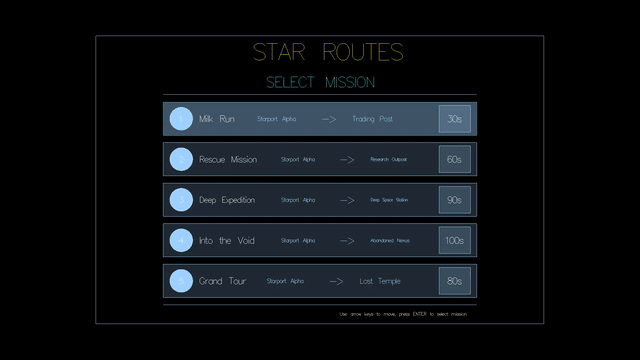

# star-routes
Project for the Functional Programming course of 2025-2026. I wrote a parser for configuration files and a game using Haskell (Parsec / Gloss). A demo video can be found below. An explanation of the configuration files is also provided, allowing you to easily create your own levels.

Run with:
```bash
stack run routes/{name-of-config-file}
````

Demo:

GitHub does not yet support videos. The video in full quality can be found in the `demo` folder, but the GIF is provided for quick viewing.

[](demo/demo.mp4)

## Configuration File

Your program reads a configuration file at startup that describes the star system. You must parse this file with a **custom parser**, and it is mandatory to use the **Parsec** library. The configuration file follows a specific syntax, which is described below. The file extension is always `.star`.

The configuration file can include planets, routes, hazards, and missions in **any order**. The only restriction is that you cannot reference planets that have not been defined yet. For example, the following file is **invalid** because the route references a planet `"MarsBase"` that has not yet been defined:

```yaml
planet "Earth" at (0, 0) type fuel
route "Earth" --> "MarsBase" fuel 10-20 time 5
planet "MarsBase" at (200, 0)
```

Comments and empty lines are allowed. Strings must always be enclosed in quotation marks. Below we describe all elements of the configuration file.

In the syntax description:

* **Curly braces** `{}` indicate a field. The name inside the braces explains the field.
* **Square brackets** `[]` indicate optional fields.
* Words outside braces or brackets are **keywords** and must appear exactly as written.

**Example:** A data structure `Shape` might be described as:

```yaml
shape {name} type {type} radius {radius} [color {color}]
```

Where `name` is a string, `type` is a string indicating the shape type, `radius` is an integer, and `color` is an optional string.

---

### Planets

Planets are described using the following syntax:

```
planet {string} at ({x}, {y}) [type {effect}]
```

Where:

* `{string}`: Unique name of the planet (string in quotes)
* `{x}` and `{y}`: The planet’s coordinates (integers)
* `{effect}`: Optional effect of the planet. Can be one of: `fuel`, `repair`, or `none`. Defaults to `none` if omitted.

#### Examples

```yaml
planet "Earth" at (0, 0) type fuel
planet "Planet X" at (100, 100)
```

---

### Routes

Routes are described using the following syntax:

```
route {start} {direction} {end} fuel {min}-{max} [time {time}]
```

Where:

* `{start}`: Name of the start planet (string in quotes)
* `{direction}`: Route direction: `-->`, `<--`, or `<->`
* `{end}`: Name of the end planet (string in quotes)
* `{min}` and `{max}`: Minimum and maximum fuel costs (integers)
* `{time}`: Optional travel time in seconds (integer). Defaults to 2 seconds if omitted.

#### Examples

```yaml
route "Earth" <-> "MarsBase" fuel 15-25 time 4
route "MarsBase" --> "JupiterStation" fuel 30-50
```

---

### Hazards

Hazards are described using the following syntax:

```
hazard {type} {name} at ({x}, {y}) radius {radius} [damage {damage}] [fuelLoss {fuelLoss}]
```

Where:

* `{type}`: Type of hazard: `asteroid`, `pirates`, `nebula`, or `radiation`
* `{name}`: Unique name of the hazard (string in quotes)
* `{x}` and `{y}`: Coordinates (integers)
* `{radius}`: Radius of the hazard (integer)
* `{damage}`: Optional damage to the ship (integer). **Required** for `asteroid` and `radiation`. Not used for `pirates`.
* `{fuelLoss}`: Optional fuel loss (integer). **Required** for `pirates`. Not used for `asteroid` or `radiation`.

#### Notes

* `nebula` hazards require no extra fields; fuel loss is randomly determined.
* `asteroid` and `radiation` require only the `damage` field. `fuelLoss` must not be used.
* `pirates` require only the `fuelLoss` field. `damage` must not be used.

#### Examples

```yaml
hazard asteroid "RockBelt" at (150, 0) radius 60 damage 30
hazard pirates "PirateZone" at (225, 225) radius 50 fuelLoss 25
hazard nebula "GreenVeil" at (300, 150) radius 120
```

---

### Missions

Missions are described with the following syntax:

```
mission {string} from {start} to {end} timeLimit {time}
```

Where:

* `{string}`: Unique mission name (string in quotes)
* `{start}`: Start planet (string in quotes)
* `{end}`: End planet (string in quotes)
* `{time}`: Time limit in seconds (integer)

#### Examples

```yaml
mission "First Steps" from "Earth" to "MarsBase" timeLimit 30
mission "Choose Your Poison" from "Start" to "Goal" timeLimit 50
```

---

## Example Configurations

### 1. Simple Example

```yaml
planet "Earth" at (0, 0) type fuel
planet "MarsBase" at (200, 0)

route "Earth" --> "MarsBase" fuel 10-10 time 5

mission "First Steps" from "Earth" to "MarsBase" timeLimit 30
```

### 2. Hazard Choice Puzzle

```yaml
planet "Start" at (0, 0)
planet "Safe Haven" at (300, 0) type repair
planet "Fuel Depot" at (150, 150) type fuel
planet "Goal" at (300, 300)

route "Start" --> "Safe Haven" fuel 20-30 time 5
route "Start" --> "Fuel Depot" fuel 10-20 time 4
route "Fuel Depot" --> "Goal" fuel 15-25 time 4
route "Safe Haven" --> "Goal" fuel 10-20 time 4

hazard asteroid "RockBelt" at (150, 0) radius 60 damage 30
hazard pirates "PirateZone" at (225, 225) radius 50 fuelLoss 25

mission "Choose Your Poison" from "Start" to "Goal" timeLimit 50
```

### 3. Order Optimization

```yaml
planet "Base" at (0, 0)
planet "Gas Station" at (200, 0) type fuel
planet "Repair Dock" at (400, 0) type repair
planet "Rock" at (200, 150)
planet "Goal" at (600, 0)

route "Base" --> "Gas Station" fuel 30-40 time 5
route "Gas Station" --> "Repair Dock" fuel 20-30 time 5
route "Repair Dock" --> "Goal" fuel 20-30 time 5

route "Base" --> "Rock" fuel 10-15 time 4
route "Rock" --> "Repair Dock" fuel 30-40 time 5
route "Rock" --> "Goal" fuel 40-50 time 6

hazard asteroid "Hidden Field" at (300, 0) radius 50 damage 40

mission "Plan Your Stops" from "Base" to "Goal" timeLimit 80
```

### 4. Risk vs Safety

```yaml
planet "Home" at (0, 0)
planet "Fast Path 1" at (200, 100)
planet "Fast Path 2" at (400, 200)
planet "Safer 1" at (150, -100) type fuel
planet "Safer 2" at (350, -200) type repair
planet "Goal" at (600, 0)

route "Home" --> "Fast Path 1" fuel 5-10 time 3
route "Fast Path 1" --> "Fast Path 2" fuel 5-10 time 3
route "Fast Path 2" --> "Goal" fuel 5-10 time 3

route "Home" --> "Safer 1" fuel 10-20 time 4
route "Safer 1" --> "Safer 2" fuel 10-20 time 4
route "Safer 2" --> "Goal" fuel 10-20 time 4

hazard nebula "Green Veil" at (300, 150) radius 120

mission "Nebula Gamble" from "Home" to "Goal" timeLimit 90
```
