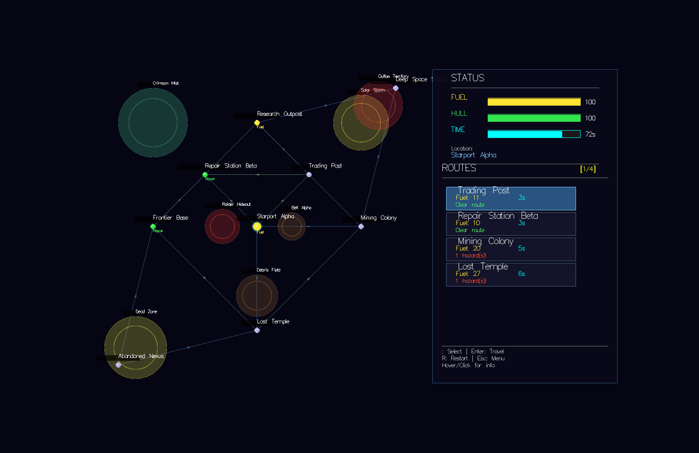
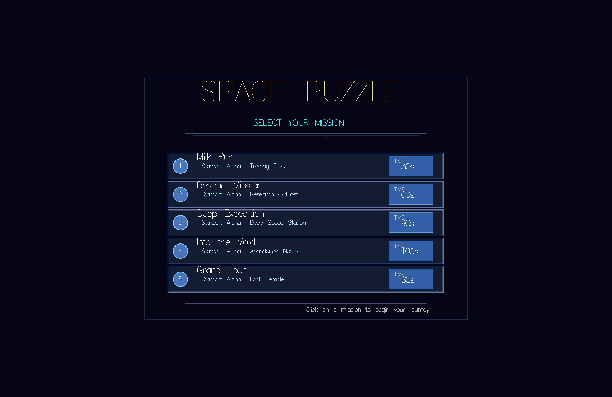

# Star Routes

## Inhoudsopgave
1. [Inleiding](#inleiding)
2. [Technische Vereisten](#technische-vereisten)  
3. [Spelcomponenten & Logica](#spelcomponenten--logica)  
4. [Configuratiebestand](#configuratiebestand-dsl)  
5. [programmaopzet & Interacties](#programmaopzet--interacties)  
6. [Testen](#testen)  
7. [Verslag](#verslag)
8. [Codeerstijl](#codeerstijl)
9. [Herhaling vereisten](#herhaling-vereisten)
10. [Algemene informatie & Deadlines](#algemene-informatie--deadlines)
11. [Voorbeeldconfiguraties](#voorbeeldconfiguraties)

---

## Inleiding

In dit derde project ontwerp en implementeer je een nieuw ruimtespel in **Haskell**. Deze keer hebben we gekozen voor een puzzelspel **Star Routes**. De speler navigeert door een sterrenstelsel waarin planeten met elkaar verbonden zijn via routes. Op weg naar de eindbestemming moet de speler kiezen welke paden veilig, logisch en efficiënt zijn, want onderweg liggen zowel voordelen als gevaren op de loer.



Het project biedt je de kans om verschillende concepten uit de cursus *Functioneel Programmeren* toe te passen in een samenhangende, betekenisvolle opdracht. Je bouwt een kleine parser, een grafische gebruikersinterface en implementeert de spelmechanica met behulp van functionele programmeerprincipes.

Dit is een **individueel project**. Samenwerken op code is niet toegestaan, al mag je natuurlijk ideeën bespreken.

### Doelstellingen

Dit project test meerdere vaardigheden die je tijdens de cursus hebt opgedaan:

- Het ontwerpen van een **AST & parser** in **Parsec**
- Het modelleren en aanpassen van een staat in een **functioneel programma**
- Het toepassen van **monads**
- Het maken van een visuele gebruikersinterface in **Gloss**
- Het schrijven van **gestructureerde, herbruikbare en zuivere code**
- Het testen van parser- en spelcomponenten met **HUnit**

## Technische Vereisten

### Verplichte libraries
Je moet minimaal gebruikmaken van:

| Doel | Library |
|------|---------|
| Grafische UI | [Gloss](https://hackage.haskell.org/package/gloss) |
| Parsing | [Parsec](https://hackage.haskell.org/package/parsec) |
| Testen | [HUnit/Spec](https://hackage.haskell.org/package/HUnit) |
| Random gedrag | [Random](https://hackage.haskell.org/package/random) |

### Verboden
- `unsafePerformIO`
- Globale mutable staat als primaire architectuur

## Spelcomponenten & Logica

### Core

Bij de start van het programma, krijgt de speler een lijst met missies te zien die uit een configuratiebestand geladen zijn. De speler kiest een missie en probeert een doelplaneet te bereiken via een netwerk van routes. Elke keuze heeft gevolgen: routes kosten brandstof, tijd en kunnen gevaren activeren. De speler moet strategisch plannen om het einde te halen voordat zijn **brandstof**, **bescherming** of **tijd** op zijn. Indien de brandstof, bescherming of tijd onder nul zakt, is de missie mislukt en krijgt de speler een game-over scherm te zien.

Een aantal belangrijke startwaarden worden niet vermeld in het configuratiebestand, maar zijn essentieel voor het spel (tijd wordt expliciet vermeld in het configuratiebestand). Deze waarden zijn **integer percentages tussen 0 en 100** en worden bij elke actie aangepast:
- Brandstof bij de start van een missie: 100%
- Bescherming bij de start van een missie: 100%

### Planeten
Planeten vertegenwoordigen de knooppunten in het stelsel. Elke planeet heeft:
- Een unieke naam: In onze bestanden zullen we er steeds voor zorgen dat dit klopt. Je zal dit dus niet hoeven te valideren.
- Een positie in het 2D-vlak: Een x- en y-coördinaat (geheel getal)
- Een optioneel éénmalig effect: Te kiezen uit een vaste lijst. **fuel** verhoogt brandstof, **repair** herstelt bescherming, en **none** geeft geen effect aan. Effecten worden steeds **slechts één keer toegepast**, namelijk bij de eerste aankomst op een planeet.

### Routes
Routes verbinden twee planeten en vormen zo een gerichte graaf. Een route wordt beschreven door:
- De richting (`-->`, `<--` of `<->`): Hierbij geeft `<->` aan dat de route in beide richtingen bewandeld kan worden en de andere twee slechts in één richting.
- Een onder- en bovengrens voor het brandstofverbruik (bijv. `20-30`): Er wordt willekeurig een waarde binnen dit bereik gekozen bij het reizen over de route.
- Een optionele reistijd (standaard: 2 seconden): De tijd die het kost om de route af te leggen. Dit wordt realtime getoond door een animatie af te spelen tijdens deze tijd.

Voorbeeld:
```yaml
route "Aarde" <-> "Marsbasis" fuel 15-25 time 4
```

Wanneer je deze route selecteert en volgt, gebeuren er drie acties:
1. Er wordt willekeurig een waarde gekozen binnen het brandstofbereik (vb.: 19).  
2. De tijd en brandstof verminderen realtime terwijl je onderweg bent.
3. Hieronder bespreken we gevaren die op de weg kunnen liggen. Deze moeten ook toegepast worden en hebben ook een effect op het schip.

Wanneer de speler, tijdens het reizen over een route, de **brandstof, bescherming of tijd onder 0** krijgt, is de missie onmiddellijk mislukt. Wat je moet weergeven, bespreken we later bij de schermen.

### Gevaren
Gevaren zijn cirkelvormige gebieden met:
- Een unieke naam: In onze bestanden zullen we er steeds voor zorgen dat dit klopt. Je zal dit dus niet hoeven te valideren.
- Een positie in het 2D-vlak: Een x- en y-coördinaat (geheel getal)
- Een effect: Elke planeet heeft een type gevaar met een bijhorend effect. In tegenstelling tot de planeten, worden gevaren **elke keer toegepast** wanneer de speler er doorheen reist en zijn ze ook niet optioneel.

Ondersteunde gevaren:
| Type | Effect |
|------|--------|
| asteroid | schade aan het schip. De bescherming gaat omlaag |
| pirates | De brandstof gaat omlaag |
| nebula | willekeurig brandstofverlies tussen 10% en 50% van je huidige brandstof |
| radiation | schade aan het schip. De bescherming gaat omlaag |

Alle gevaren op een route worden steeds toegepast. Dit wil zeggen dat als er meerdere gevaren op een route liggen, ze allemaal hun effect zullen hebben.

Voorbeeld: Een schip neemt een route met twee gevaren: een asteroïde die 10% schade toebrengt en een nebula die door random keuze 23% brandstofverlies veroorzaakt. Als het schip 80% brandstof en 70% bescherming had bij het starten van de route, zal het schip na het passeren van de gevaren 60% bescherming (70% - 10%) en 57% (80% - 23%) brandstof overhouden.

### Missies
Een missie wordt steeds beschreven door:
- Een unieke naam van de missie: In onze bestanden zullen we er steeds voor zorgen dat dit klopt. Je zal dit dus niet hoeven te valideren.
- De start- en eindplaneet: Voorgesteld door hun unieke namen.
- De tijdslimiet in seconden

Zodra de speler de eindplaneet bereikt binnen de tijdslimiet en zonder dat brandstof of bescherming onder nul is gezakt, is de missie succesvol afgerond en krijgt de speler een "Mission Successful" scherm te zien.

## Configuratiebestand

Je programma leest bij het opstarten een configuratiebestand waarin het sterrenstelsel is beschreven. Dit bestand moet je parseren met een zelfgeschreven parser. Het is hierbij verplicht om gebruik te maken van de **Parsec** bibliotheek. Het configuratiebestand volgt een specifieke syntax die we hieronder beschrijven. De extensie van de bestanden is steeds `.star`.

Het configuratiebestand kan planeten, routes, gevaren en missies bevatten in **eender welke volgorde**. Hierbij is het enkel belangrijk dat je geen planeten kan gebruiken die nog niet gedefinieerd zijn. Het volgende bestand is bijvoorbeeld niet geldig omdat de route een planeet "Marsbasis" gebruikt die nog niet gedefinieerd is:

```yaml
planet "Aarde" at (0, 0) type fuel
route "Aarde" --> "Marsbasis" fuel 10-20 time 5
planet "Marsbasis" at (200, 0)
```

Commentaar en lege regels zijn toegestaan. Strings moeten steeds tussen aanhalingstekens staan. We overlopen alle elementen van het configuratiebestand hieronder. Bij de beschrijving van de syntax gebruiken we de volgende notatie: **accolades** `{}` duiden steeds een veld aan. De naam binnen de accolades worden gebruikt om extra uitleg te geven over het veld zelf. **Vierkante haken** `[]` duiden optionele velden aan. Velden die niet tussen accolades of vierkante haken staan, zijn vaste sleutelwoorden die steeds exact zo moeten voorkomen.

Voorbeeld: Een datastructuur `Vorm` kan bijvoorbeeld als volgt beschreven worden:
```yaml
shape {naam} type {type} radius {radius} [kleur {kleur}]
```
Hierbij is `naam` een string, `type` een string die het type vorm aanduidt, `radius` een geheel getal en `kleur` een optioneel veld dat een string is.

### Planeten

Planeten worden beschreven met de volgende syntax:

```
planet {string} at ({x}, {y}) [type {effect}]
```

Waarbij:
- `{string}`: De unieke naam van de planeet (string tussen aanhalingstekens)
- `{x}` en `{y}`: De x- en y-coördinaat van de planeet (gehele getallen)
- `{effect}`: Het optionele effect van de planeet. Dit kan één van de volgende waarden zijn: `fuel`, `repair`, of `none`. Indien niet opgegeven, is het effect `none`.

#### Voorbeelden
```yaml
planet "Aarde" at (0, 0) type fuel
planet "Planeet X" at (100, 100)
```

### Routes

Routes worden beschreven met de volgende syntax:

```
route {start} {richting} {einde} fuel {min}-{max} [time {tijd}]
```

Waarbij:
- `{start}`: De naam van de startplaneet (string tussen aanhalingstekens)
- `{richting}`: De richting van de route. Dit kan één van de volgende waarden zijn: `-->`, `<--`, of `<->`.
- `{einde}`: De naam van de eindplaneet (string tussen aanhalingstekens)
- `{min}` en `{max}`: De minimale en maximale brandstofkosten voor de route (gehele getallen)
- `{tijd}`: De optionele reistijd in seconden (geheel getal). Indien niet opgegeven, is de standaardwaarde 2 seconden.

#### Voorbeelden
```yaml
route "Aarde" <-> "Marsbasis" fuel 15-25 time 4
route "Marsbasis" --> "Jupiterstation" fuel 30-50
```

### Gevaren

Gevaren worden beschreven met de volgende syntax:

```
hazard {type} {naam} at ({x}, {y}) radius {radius} [damage {schade}] [fuelLoss {brandstofverlies}]
```

Waarbij:
- `{type}`: Het type gevaar. Dit kan één van de volgende waarden zijn: `asteroid`, `pirates`, `nebula`, of `radiation`.
- `{naam}`: De unieke naam van het gevaar (string tussen aanhalingstekens)
- `{x}` en `{y}`: De x- en y-coördinaat van het gevaar (gehele getallen)
- `{radius}`: De straal van het gevaar (geheel getal)
- `{schade}`: De optionele schade aan het schip (geheel getal). Dit veld is alleen vereist voor gevaren van het type `asteroid` en `radiation`.
- `{brandstofverlies}`: Het optionele brandstofverlies (geheel getal). Dit veld is alleen vereist voor gevaren van het type `pirates`.

#### Opmerkingen
- Voor gevaren van het type `nebula` is er geen extra veld nodig, aangezien het brandstofverlies willekeurig wordt bepaald.
- Voor gevaren van het type `asteroid` en `radiation` is alleen het `damage` veld vereist. Dit is dus niet optioneel voor deze types. Het `fuelLoss` veld mag in dit geval niet gebruikt worden.
- Voor gevaren van het type `pirates` is alleen het `fuelLoss` veld vereist. Dit is dus niet optioneel voor dit type. Het `damage` veld mag in dit geval niet gebruikt worden.

#### Voorbeelden
```yaml
hazard asteroid "Rotsengordel" at (150, 0) radius 60 damage 30
hazard pirates "Piratenzone" at (225, 225) radius 50 fuelLoss 25
hazard nebula "Groene Sluier" at (300, 150) radius 120
``` 

### Missies

Missies worden beschreven met de volgende syntax:

```
mission {string} from {start} to {einde} timeLimit {tijd}
```

Waarbij:
- `{string}`: De unieke naam van de missie (string tussen aanhalingstekens)
- `{start}`: De naam van de startplaneet (string tussen aanhalingstekens)
- `{einde}`: De naam van de eindplaneet (string tussen aanhalingstekens)
- `{tijd}`: De tijdslimiet voor de missie in seconden (geheel getal)

#### Voorbeelden
```yaml
mission "Eerste Stapjes" from "Aarde" to "Marsbasis" timeLimit 30
mission "Kies je Vergif" from "Start" to "Doel" timeLimit 50
```

## programmaopzet & Interacties

### Opstarten

Het programma wordt uitgevoerd met `stack run <configuratiebestand>`, waarbij `<configuratiebestand>` het pad is naar het configuratiebestand dat de missies, planeten, routes en gevaren beschrijft.

### Schermen
Je spel moet minstens de volgende schermen bevatten:
1. Een missiekeuzescherm: Dit scherm toont een lijst van beschikbare missies uit het configuratiebestand. De speler moet hier een missie kunnen selecteren om te starten.
2. Een spelweergave: Dit scherm toont de huidige staat van het spel, inclusief de kaart met planeten en routes, de status van de speler (brandstof, bescherming, tijd), en opties om routes te selecteren en te volgen.
3. Twee eindschermen:
   - Een "Mission Successful" scherm dat verschijnt wanneer de speler de missie succesvol afrondt.
   - Een "Game Over" scherm dat verschijnt wanneer de speler faalt (brandstof, bescherming of tijd onder nul).

We overlopen kort de drie schermen met hun belangrijkste functies en interacties.

#### Missiekeuzescherm

Dit scherm toont een lijst van missies die de speler kan selecteren. De speler kan met de pijltjestoetsen door de lijst navigeren en met Enter een missie starten. Bij het weergeven van de missies, toon je ook een korte samenvatting van elke missie. Deze samenvatting bevat minstens de start- en eindplaneet, en de tijdslimiet.



#### Spelweergave

In dit scherm wordt de kaart van het sterrenstelsel weergegeven, inclusief alle planeten en routes. We splitsen dit scherm voor de eenvoud op in twee delen: De kaartweergave en het statuspaneel.

1. **Kaartweergave**: Hier worden alle planeten en routes getekend. Planeten kan je eenvoudig weergeven als cirkels, met de naam ernaast getekend. Routes kunnen weergegeven worden als lijnen tussen de planeten. Gevaren kan je tot slot weergeven als gekleurde cirkels op de kaart. Je bent uiteraard ook vrij om creatiever te zijn met de wergave, zolang de informatie maar duidelijk is. De volgende interacties op de kaart zijn verplicht:
    - Wanneer de muis over een planeet of route beweegt, toon je de extra informatie over dat object (bijvoorbeld naam, effecten, kosten, etc.). Je bent vrij om deze informatie op een manier te tonen die je zelf geschikt vindt (bijvoorbeeld onderaan het scherm, als tooltip of in een apart paneel).
    - Wanneer een route geselecteerd is, moet deze visueel onderscheiden worden (bijvoorbeeld door de kleur te veranderen of dikker te tekenen).

2. **Statuspaneel**: Dit paneel toont de huidige status van de speler, alsook de beschikbare acties. Het statuspaneel moet minstens de volgende informatie tonen:
    - Huidige brandstofpercentage
    - Huidige beschermingspercentage
    - Resterende tijd voor de missie
    - Huidige planeet
    - Beschikbare routes vanaf de huidige planeet. Een route is enkel beschikbaar als de speler voldoende brandstof heeft om deze te volgen. Voor het selecteren van een route, kan de speler gebruikmaken van de pijltjestoetsen om door de beschikbare routes te navigeren en met Enter de geselecteerde route te volgen.

#### Eindschermen

Deze schermen verschijnen wanneer de speler de missie succesvol afrondt of faalt. Ze tonen een passende boodschap ("Mission Successful" of "Game Over") en bieden de speler de optie om terug te keren naar het missiekeuzescherm of het spel te herstarten.

### Herhaling interacties
| Toets | Functie |
|-------|---------|
| Pijltjestoetsen | Selecteren van de missie / Selecteren van een route |
| Enter | Bevestigen van een missie / Bevestigen van een route |
| R | Herstart de huidige missie |
| Esc | Verlaat het spel (ga terug naar het missiekeuzescherm) |
| Muis (hover) | Toont informatie over objecten |

## Testen

Je bent verplicht om **unit tests** te schrijven voor zowel je parser als de spellogica. Deze tests moeten gebruikmaken van de **HUnit** bibliotheek (of hspec). Je moet minstens de volgende onderdelen testen:

1. **Parser**
   - Minimale unit tests voor elke constructie (planet, route, hazard, mission)
   - Een succes-test voor een volledig bestand

2. **Spellogica**
   - Routekosten en -effecten
   - Hazarddetectie & afhandeling
   - Win- en verliescondities
   - Mogelijke hulpfuncties die je hebt geschreven

Je mag uiteraard extra testen schrijven, maar de bovenstaande zijn verplicht. Zorg ervoor dat je testen volledig en goed gedocumenteerd zijn zodat het duidelijk is wat er getest wordt en waarom.

## Verslag

Naast de code schrijf je een **kort verslag** met daarin:

- Een introductie van je spel & ontwerpkeuzes
- Een uitleg van je **gebruik van monads**: waarom je ze hebt gekozen, hoe je ze hebt toegepast, en welke voordelen ze boden in jouw implementatie
- Een overzicht van welke delen getest zijn (en welke niet)
- De beschrijving & oplossing van een zelfontworpen level: Het is hierbij de bedoeling dat je zelf een interessante puzzel bedenkt die gebruikmaakt van de verschillende componenten. Beschrijf kort de opzet van je level, de uitdagingen die het biedt, en hoe een speler deze kan oplossen. Aan de hand van jouw beschrijving moet ik in staat zijn om je level op te lossen. 
- Een korte reflectie over hoe het project verliep

Je voegt dit verslag in PDF-formaat toe aan je projectrepository onder de naam `verslag.pdf`.

## Codeerstijl

We verwachten dat je code netjes en goed gestructureerd is. Volg de volgende richtlijnen:
- Gebruik betekenisvolle namen voor functies, variabelen en types.
- Vermijd lange functies; probeer functies kort en overzichtelijk te houden.
- Maak gebruik van modules om je code logisch te organiseren.
- Voeg commentaar toe waar nodig om de functionaliteit van complexe stukken code uit te leggen.
- Gebruik where- en let-bindingen om herhaling te vermijden en de leesbaarheid te verbeteren.
- Vermijd "magic numbers" en hardgecodeerde waarden. Gebruik in plaats daarvan benoemde constanten.
- Probeer, waar mogelijk, gebruik te maken van bestaande functies.
- Pas HLint toe om je code te controleren op stijl- en kwaliteitsproblemen.

Voeldoet je code niet aan deze richtlijnen, dan kan dit leiden tot puntenaftrek tijdens de beoordeling.

## Herhaling vereisten

### Functionele vereisten

Je project moet voldoen aan alle functionele vereisten zoals beschreven in de secties hierboven, inclusief maar niet beperkt tot:
- Correcte parsing van het configuratiebestand
- Juiste implementatie van spelmechanica (planeten, routes, gevaren, missies)
- Werkende grafische gebruikersinterface met de vereiste schermen en interacties

### Niet-functionele vereisten

Naast de basisfunctionaliteit, moet je project ook voldoen aan de volgende niet-functionele vereisten. Deze vereisten zijn even belangrijk als de functionele vereisten en zullen ook meegewogen worden in de beoordeling:
- Dit project test je kennis over parsing, monads. Je project moet minstens gebruik maken van monads. Dit project laat zeker toe om al deze concepten toe te passen. We kijken zeker of je implementatie gebruik maakt van deze concepten.
- De concepten uit de eerste twee projecten blijven uiteraard ook van toepassing. Zorg ervoor dat je deze principes blijft toepassen in je code.
- Je code moet goed gestructureerd en gedocumenteerd zijn, met een duidelijke scheiding tussen verschillende modules en functies.
- Je code moet getest zijn met unit tests die de belangrijkste functionaliteiten dekken. Probeer dit zeker niet uit te stellen tot het laatste moment. Deze testen kunnen je tijdens de ontwikkeling helpen om fouten vroeger te ontdekken. In tegenstelling tot de vorige projecten zijn een klein aantal tests hier onvoldoende.

### Verslag

Je verslag moet duidelijk en beknopt zijn, en alle gevraagde onderdelen bevatten. Het verslag is een belangrijk onderdeel van je project en zal meegewogen worden in de beoordeling.

## Algemene informatie & Deadlines

- Schrijf efficiënte code, maar ga niet over-optimaliseren: geef de voorkeur aan elegante, goed leesbare code. Voorzie voldoende commentaar en vul de bestaande commentaar aan indien nodig. **We kijken ook naar je documentatie bij de beoordeling.**
- Projecten die ons niet bereiken voor de deadline worden niet meer verbeterd: dit betekent het verlies van **alle** te behalen punten voor het project. Hou dus goed rekening met opgelegde deadline.
- Dit is een **individueel project** en dient dus door jou persoonlijk gemaakt te worden. Het is ten strengste verboden code uit te wisselen, op welke manier dan ook. Het overnemen van code beschouwen we als fraude (van beide betrokken partijen) en zal in overeenstemming met het examenreglement behandeld worden. Het overnemen of aanpassen van code van andere bronnen zonder referentie is niet toegelaten en wordt gezien als fraude.
- Om ons werk te sparen tijdens het verbeteren, zorgen jullie er zelf voor dat jullie projecten compileren en slagen voor enkele basistesten. **Projecten die niet compileren krijgen automatisch een nul**. Om een “maar op mijn machine werkte het wel...” te vermijden, gebruiken we voor dit project SubGit. Op SubGit kan je steeds zien of jouw code correct compileert of niet. Wanneer je project niet compileert op SubGit zal je code niet geaccepteerd worden op de "main" branch.
- We verwachten dat je ongeveer **24 to 36 uur** zal nodig hebben om dit project af te werken.
- Met dit project kan je **13** punten van de 20 punten verdienen voor Functioneel Programmeren.
- De deadline voor dit project is dinsdag 23 december om 23:00 uur. Problemen kan je altijd (voor de deadline) melden.

## Voorbeeldconfiguraties

### 1. Simpel voorbeeld (handig tijdens parserontwikkeling)

```
planet "Aarde" at (0, 0) type fuel
planet "Marsbasis" at (200, 0)

route "Aarde" --> "Marsbasis" fuel 10-10 time 5

mission "Eerste Stapjes" from "Aarde" to "Marsbasis" timeLimit 30
```

### 2. Hazard-keuzepuzzel

```
planet "Start" at (0, 0)
planet "Veilige Haven" at (300, 0) type repair
planet "Brandstof Depot" at (150, 150) type fuel
planet "Doel" at (300, 300)

route "Start" --> "Veilige Haven" fuel 20-30 time 5
route "Start" --> "Brandstof Depot" fuel 10-20 time 4
route "Brandstof Depot" --> "Doel" fuel 15-25 time 4
route "Veilige Haven" --> "Doel" fuel 10-20 time 4

hazard asteroid "Rotsengordel" at (150, 0) radius 60 damage 30
hazard pirates "Piratenzone" at (225, 225) radius 50 fuelLoss 25

mission "Kies je Vergif" from "Start" to "Doel" timeLimit 50
```

### 3. Volgorde-optimalisatie

```
planet "Basis" at (0, 0)
planet "Tankstation" at (200, 0) type fuel
planet "Reparatiedok" at (400, 0) type repair
planet "Steen" at (200, 150)
planet "Doel" at (600, 0)

route "Basis" --> "Tankstation" fuel 30-40 time 5
route "Tankstation" --> "Reparatiedok" fuel 20-30 time 5
route "Reparatiedok" --> "Doel" fuel 20-30 time 5

route "Basis" --> "Steen" fuel 10-15 time 4
route "Steen" --> "Reparatiedok" fuel 30-40 time 5
route "Steen" --> "Doel" fuel 40-50 time 6

hazard asteroid "Verborgen Veld" at (300, 0) radius 50 damage 40

mission "Plan je Stops" from "Basis" to "Doel" timeLimit 80
```

### 4. Risico tegen veiligheid

```
planet "Thuis" at (0, 0)
planet "Snelpad 1" at (200, 100)
planet "Snelpad 2" at (400, 200)
planet "Veiliger 1" at (150, -100) type fuel
planet "Veiliger 2" at (350, -200) type repair
planet "Doel" at (600, 0)

route "Thuis" --> "Snelpad 1" fuel 5-10 time 3
route "Snelpad 1" --> "Snelpad 2" fuel 5-10 time 3
route "Snelpad 2" --> "Doel" fuel 5-10 time 3

route "Thuis" --> "Veiliger 1" fuel 10-20 time 4
route "Veiliger 1" --> "Veiliger 2" fuel 10-20 time 4
route "Veiliger 2" --> "Doel" fuel 10-20 time 4

hazard nebula "Groene Sluier" at (300, 150) radius 120

mission "Nebula Gok" from "Thuis" to "Doel" timeLimit 90
```
